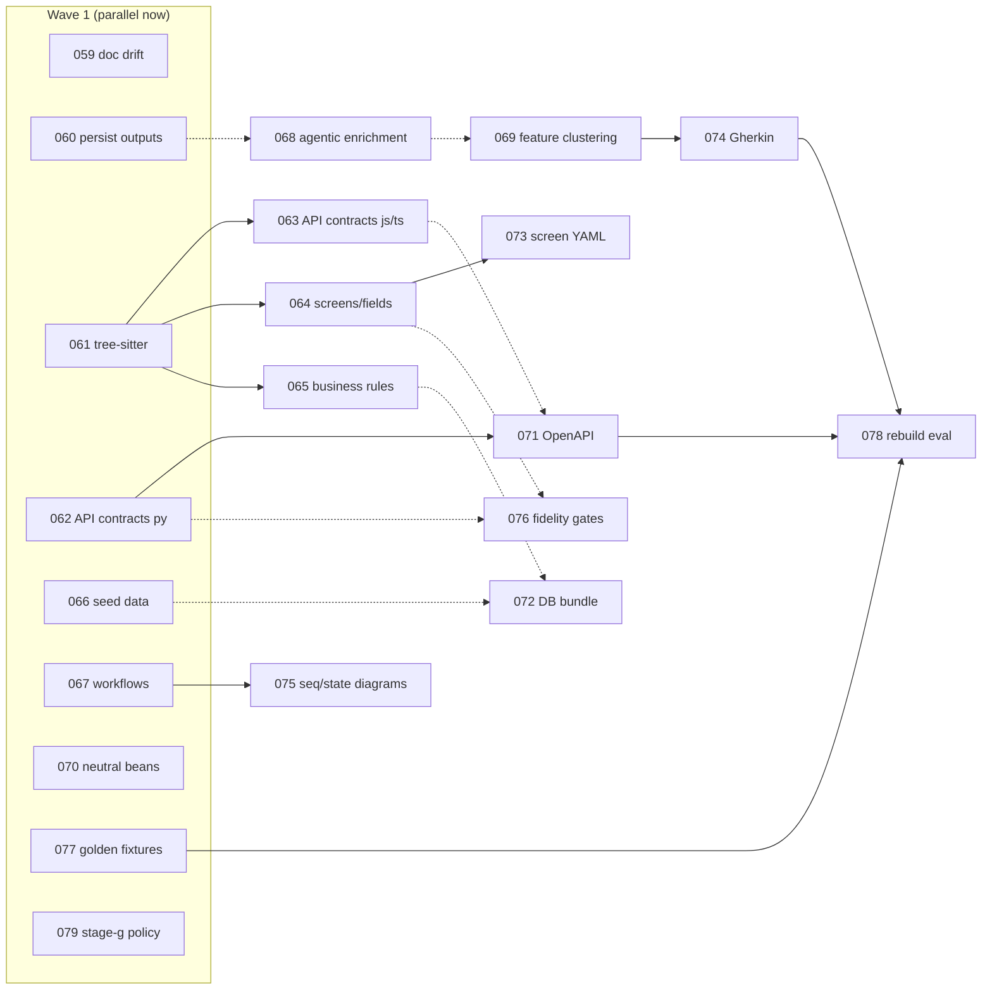

# RepoMirrorKit — Recreation-Grade Roadmap

**Created:** 2026-07-03
**Author:** Claude Code (full audit session)
**Status:** Plan — beans BEAN-059 through BEAN-079 created as Unapproved

---

## North Star

Shift RepoMirrorKit from "generate realistic practice beans" to **"generate requirements and design artifacts faithful enough that an agentic build process can produce a true functional replacement of the source application — possibly in a different framework."**

Explicitly in scope: behavior, contracts, data design, screen/field inventories, field→model mappings, business rules, navigation, seed data.
Explicitly out of scope: visual fidelity (colors, themes, styling) — a rebuild will use a different design system.

## The Gap (audit summary, 2026-07-03)

The pipeline architecture is sound. The gap is **data capture and synthesis**, in four layers:

1. **Extraction depth** — `ApiSurface.request_schema`/`response_schema` are defined but never populated by any analyzer. No form/field extraction, no field→model mapping, no business-rule/validation mining, no seed data, no state machines. Regex extraction is the ceiling; tree-sitter/AST is needed for contracts and rules.
2. **Enrichment is myopic** — per-surface single-shot LLM calls (≤3 snippets × 4,000 chars) cannot trace a feature end-to-end. Needs an agentic pass with repo tool access, plus a synthesis stage clustering surfaces into features.
3. **Design artifacts** — machine-readable specs first (OpenAPI 3.1, SQL DDL + JSON Schema, screen YAML, Gherkin), Mermaid diagrams rendered *from* them for human review. Never Mermaid as source of truth.
4. **No fidelity measurement** — coverage gates cannot fail by construction. Needs recreation-readiness gates and a rebuild eval harness (harvest fixture → agent rebuilds from output only → parity scoring). Without this, no improvement is measurable.

## Work Breakdown

Four tracks + a foundations phase. Each item is a bean under `ai/beans/`.

### Phase 0 — Foundations
| Bean | Title | Hard deps |
|------|-------|-----------|
| BEAN-059 | Fix `--llm` flag doc drift + config default mismatch | — |
| BEAN-060 | Persist stage outputs → real `--resume` | — |
| BEAN-061 | Tree-sitter extraction foundation | — |

### Track A — Extraction depth
| Bean | Title | Hard deps |
|------|-------|-----------|
| BEAN-062 | API contract extraction — Python (Flask/FastAPI, stdlib `ast`) **[tracer bullet]** | — |
| BEAN-063 | API contract extraction — JS/TS (Express/NestJS/Next.js) | 061 |
| BEAN-064 | `ScreenSurface` + form/field extraction + field→model mapping | 061 |
| BEAN-065 | `BusinessRuleSurface` — validation-library + DB-constraint mining | 061 (JS/TS part) |
| BEAN-066 | `SeedDataSurface` — enums, lookup tables, fixtures, migration seeds | — |
| BEAN-067 | `WorkflowSurface` — entity state machines | — (soft: 061) |

### Track B — Enrichment & synthesis
| Bean | Title | Hard deps |
|------|-------|-----------|
| BEAN-068 | Agentic enrichment v2 (repo tool access, feature tracing, Batch API, model bump) | — (soft: 060) |
| BEAN-069 | Feature clustering stage (C3) → `features/FEAT-*.md` + `build-manifest.json` DAG | — (soft: 068) |
| BEAN-070 | Framework-neutral bean language + confidence/gaps fields | — |

### Track C — Design artifacts
| Bean | Title | Hard deps |
|------|-------|-----------|
| BEAN-071 | OpenAPI 3.1 contract generator | 062 (soft: 063) |
| BEAN-072 | DB design bundle — SQL DDL + JSON Schema + seed data | — (soft: 065, 066) |
| BEAN-073 | Screen spec YAML + Mermaid navigation map | 064 |
| BEAN-074 | Gherkin `.feature` generation per feature cluster | 069 |
| BEAN-075 | Sequence + state Mermaid diagrams | 067 (soft: 068) |

### Track D — Fidelity loop & orchestration
| Bean | Title | Hard deps |
|------|-------|-----------|
| BEAN-076 | Fidelity coverage gates (recreation-readiness metrics) | — (soft: 062, 064) |
| BEAN-077 | Golden parity fixtures (request/response captures for fixture apps) | — |
| BEAN-078 | Rebuild eval harness (agent rebuilds from output; parity scoring) | 071, 074, 077 |
| BEAN-079 | Stage G orchestration-policy parameterization + telemetry hooks | — |

## Dependency Graph

Solid arrows = hard dependencies. Dotted = soft (start without, integrate when the other lands).

## Parallelism / Sequencing

**Series vs parallel: mostly parallel.** Five waves; within a wave every bean can run on its own branch simultaneously (existing bean-branch → test → main workflow).

| Wave | Beans | Notes |
|------|-------|-------|
| 1 | 059, 060, 061, 062, 066, 067, 070, 077, 079 | 9 independent starts. 061 and 068-prep are the long poles. |
| 2 | 063, 064, 065, 068, 071, 072, 076 | Unblocked by 061/062. 068 can also start in Wave 1 if 060 is skipped as a soft dep. |
| 3 | 069, 073, 075 | Synthesis + design artifacts. |
| 4 | 074 | Gherkin from feature clusters. |
| 5 | 078 | Keystone: the eval harness that makes fidelity measurable. |

**Critical path:** 068 → 069 → 074 → 078 (enrichment → clustering → Gherkin → eval). Secondary: 061 → 064 → 073.

**Recommended first vertical slice (proves the concept end-to-end):**
BEAN-062 (populate Flask/FastAPI contracts) → BEAN-071 (OpenAPI) → BEAN-076 (gate on % populated contracts), all against the existing `python-flask` fixture. Small, no new heavy deps, and demonstrates "contract fidelity" before the big tree-sitter/agentic investments.

**Merge-conflict watch:** 062/063/064/065/066/067 all touch `surfaces.py` and `pipeline.py`. Keep additions append-only (new dataclasses, new analyzer registrations) and rebase frequently; or land a tiny shared "surface registry" refactor first if conflicts bite.

## Measuring Success

The plan is done when, for both fixture apps (`python-flask`, `ts-next`):
1. `harvest` emits populated OpenAPI, DB bundle, screen specs, feature files, and a build manifest with zero `TODO:` placeholders when LLM is enabled.
2. BEAN-078's harness has an agent rebuild the fixture **from the output directory alone** and the parity score (Gherkin pass-rate + golden replay + schema diff) exceeds an agreed threshold (propose ≥90% scenarios for fixtures).
3. Fidelity gates (BEAN-076) run in CI and fail on regression.

Telemetry from BEAN-078/079 doubles as the model-comparison and orchestration-experiment rig.
